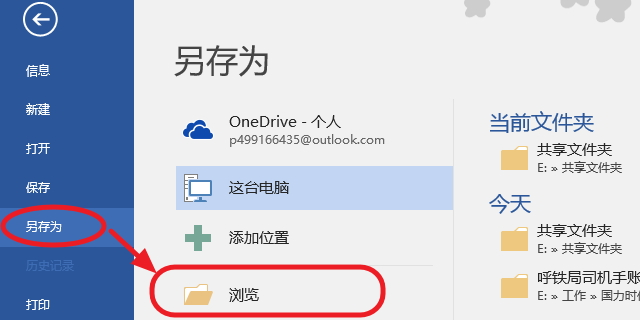

### 目录 
-------------------------------
- <a href="#dir">资料目录管理</a>
- <a href="#file">文件上传</a>
- <a href="#tutorials">文件转换教程</a>

### <a href="#" name="dir">资料目录管理</a>
-------------------------------
#### 目录创建
分为顶级目录和一般目录，其中顶级目录一般用于大的分类（如行车资料、应急处理等），顶级目录不应过多。一般目录的创建在指定目录上点击**添加子目录**即可，顶级目录则需要点击上方的**添加顶级目录**按钮，需要注意的是：目录的名称不能超过20个字，并且在同一目录下不能添加同名的子目录。

#### 删除目录
您可能已经注意到了，在每个目录栏的右侧都有一个删除按钮，点击此按钮可将对应的目录删除，但是**请注意，此操作无法还原**，另外，您无法直接删除具有子目录或者文件的目录，您需要先将其子目录及文件全部删除之后，才能删除此目录。

### <a href="#" name="file">文件上传</a>
-------------------------------
#### 说明
为了使终端使用者能快速搜索到期望的内容，您需要将资料转换为html格式的文件（转换方法见下文），若您经过转换后的文件个数不只一个，您需要将所有文件打包为一个压缩包（**注意，您只需要将所有转换后的文件选中，右键添加至压缩包即可，不要再建立一个文件夹，把所有文件放到里面后再压缩，再次强调**），另外，系统只接收`.Zip、.htm、.html`三种格式的文件上传。

#### 文件转html方法
1. pdf格式的文件转html
    对于此类转换，我们为您提供了专业的转换工具（**Solid Converter v8，另附<a href="#solidV8">使用教程</a>**）
2. word文件转html
    打开word文件 -> 点击右上角菜单**文件** -> 另存为 -> 在文件格式栏选择html -> 确定 （另附**<a href="#word">图文教程</a>**）
3. excel文件转html
    打开exel文件 -> 点击右上角菜单**文件** -> 另存为 -> 在文件格式栏选择html -> 确定（另附**<a href="#excel">图文教程</a>**）

### <a href="#" name="tutorials">文件转换教程</a>
-------------------------------
#### <a name="solidV8">Solid Converter v8使用教程</a>
安装完成后显示如下界面，请您选择第二项《**我已经有解码密码，并想解开 Solid Converter**》：  

点击解锁后出此如下界面，请您按照图中所填信息准确无误地填写到输出框中：  

点击确定后，将会弹出解锁成功提示：  

解锁完成显示程序主界面，点击**打开 PDF**，选择您要轮换的文件：  

选好文件后，在界面上方工具栏处选择需要转换的格式（此处请选择PDF 至 HTML）：  

点击**PDF至HTML**，并选择保存的位置，然后点击保存：  

等待转换完成（右下角的进度条表示当前转换进度）：  

转换完成后，找到您保存文件的位置，您将会看到如下文件，请您选中它们，右键，添加到压缩包（**PS：一定要用压缩成ZIP格式，否则无法上传**）：  

#### <a name="word">word转html教程</a>
此处以Word 2013为例（其他版本操作大同小异）。
首先，打开您需要转换的word文件，点击左上角的菜单**文件**：  

点击另存为，选择文件路径（低版本的word点击另存为会直接弹出对话框）：  

在弹出的对话框中选择好您要保存的路径，同时点击下方的保存类型下拉列表：  

选择**网页（.htm; .html）**，点击保存：  

找到您所保存的位置，将转换后的文件打包为**zip**压缩包：  

#### <a name="excel">excel转html教程</a>
与<a href="#word">word转html教程</a>大同小异
